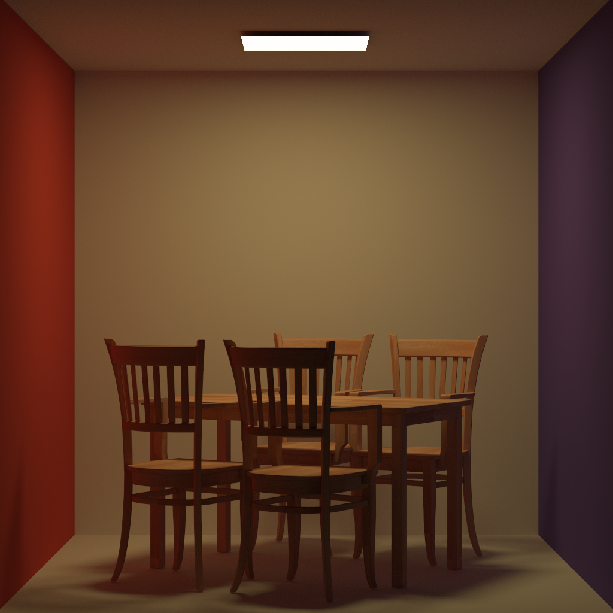
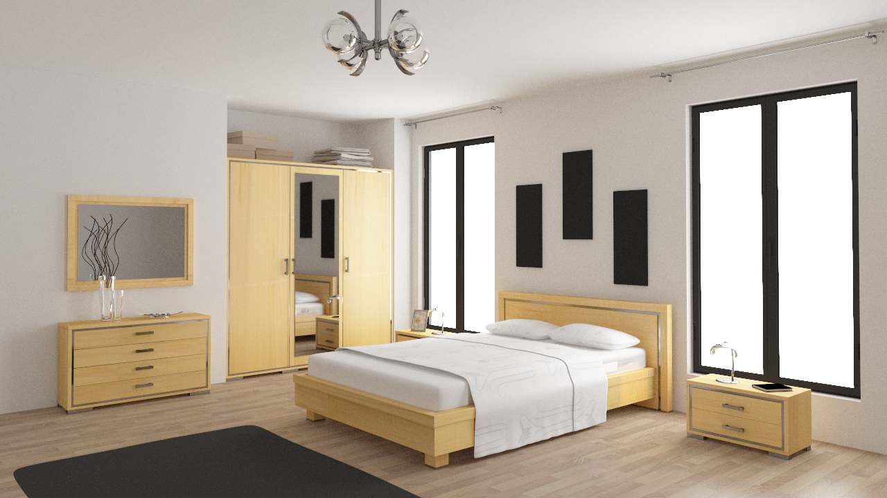

# Simple Monte-Carlo Path Tracer

This project implements a simple Monte-Carlo path tracer in C++ supporting Phong, Lambertian and perfect specular materials.

This path tracer benefits from path tracing alogirthm based on the light transport equation, multi-importance sampling scheme and other technics.

## Requirements
- gcc (>= 9.4.0)
- CMake (>= 3.10)
- OpenMP
- Doxygen (optional)

## Build Guidence
```c
cmake -B build -S .
cmake --build build
```

to generate the document
```
doxygen DOXYGEN
```
## Usage
```
pt <0> <1> <2> [--bounce=INTEGER] [--lsamples=INTEGER] [-o=STRING] [--sample=INTEGER]
```

Positional arguments:

  <0> STRING            path to scene file (wavefron obj supported)

  <1> STRING            path to configuration of lights and the camera (see example)

  <2> STRING            path to textures directory

Named arguments:

  [--bounce=INTEGER]     [default: 20]

  [--lsamples=INTEGER]   [default: 10] number of samples of light sources

  [-o=STRING]            [default: out.bmp]

  [--sample=INTEGER]     [default: 120] number of samples per pixel

## Result
- Lambertian Cornell Box (512 SPP)
    
- Phong-modeled material (256 SPP)
    
- Complicated Scene (1024 SPP)
    